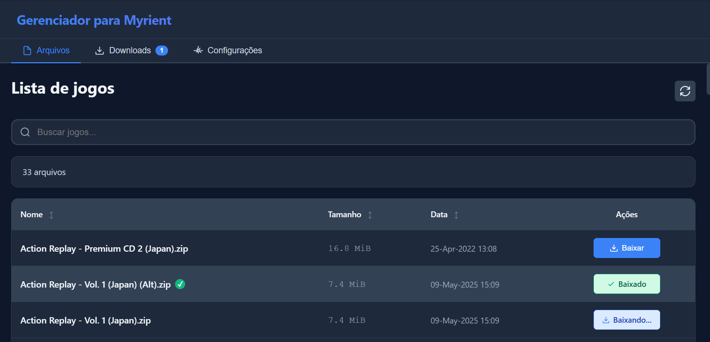

<div align="center" id="erista-app">

# 🎮 Gerenciador Myrient

<p>
  
  
  
  
  
</p>

<p>Gerenciador de downloads moderno e eficiente desenvolvido em <b>Electron</b>, focado em facilitar o acesso ao repositório <b>Myrient</b>.</p>

</div>

<p align="center">
  
</p>

---

#### ✨ Funcionalidades

- ✅ **Downloads paralelos** com conexões simultâneas  
- ✅ **Múltiplos downloads** (até 4 simultâneos)  
- ✅ **Busca e filtros** em tempo real  
- ✅ **Histórico persistente** de todos os downloads  
- ✅ **Interface moderna** com tema escuro  

---

#### 🚀 Próximas Atualizações

> 🧪 O projeto ainda está em **fase beta** — novas funcionalidades estão a caminho!

#### 🔮 Planejadas:
- 📦 **Extração automática** de arquivos `.zip`
- 🔄 **Conversão de ISO → GOD**
- 💾 **Conversão para formato `.hex`** (compatível com Xbox 360 desbloqueado)
- 🖥️ **Transferência direta** para HD externo do Xbox 360
- ✅ **Verificação de integridade** dos arquivos baixados

#### 💝 Projeto Gratuito

Este é um projeto **100% gratuito e open-source**, desenvolvido para a comunidade de entusiastas de Xbox 360. Sinta-se livre para usar, modificar e contribuir!

---

## 🚀 Como Rodar o Projeto

#### Pré-requisitos

- **Node.js** (versão 16 ou superior)
- **npm** ou **yarn**

#### Instalação

```bash
# Clone o repositório
git clone https://github.com/seu-usuario/myrient-manager.git

# Entre na pasta do projeto
cd myrient-manager

# Instale as dependências
npm install
```

#### Executar o Aplicativo

```bash
# Modo desenvolvimento
npm start

# Ou usando yarn
yarn start
```

#### Build para Produção

```bash
# Gerar executável para Windows
npm run build

# O executável estará na pasta dist/
```

---

## 🛠️ Tecnologias Usadas

#### Core
- **[Electron](https://www.electronjs.org/)** - Framework para aplicativos desktop
- **[Node.js](https://nodejs.org/)** - Runtime JavaScript
- **JavaScript ES6+** - Linguagem principal

#### Download & Scraping
- **[Cheerio](https://cheerio.js.org/)** - Parser HTML (scraping)
- **[node-fetch](https://github.com/node-fetch/node-fetch)** - Cliente HTTP
- **Downloads Paralelos** - Sistema customizado com múltiplas conexões

#### Interface
- **HTML5** - Estrutura da interface
- **CSS3** - Estilização moderna com animações
- **Vanilla JavaScript** - Manipulação DOM sem frameworks

#### Persistência
- **JSON Store** - Armazenamento local de configurações e histórico
- **Electron Store** - Gerenciamento de dados persistentes

#### Arquitetura
- **IPC (Inter-Process Communication)** - Comunicação segura entre processos
- **Context Isolation** - Segurança do Electron
- **Modular Architecture** - Código organizado e manutenível

---

## 🎯 Roadmap

### ✅ Fase 1 - Concluída
- [x] Sistema de downloads paralelos
- [x] Interface com abas
- [x] Gerenciamento de downloads
- [x] Configurações persistentes
- [x] Filtros e busca

### 🚧 Fase 2 - Em Desenvolvimento
- [ ] Extração automática de arquivos .zip
- [ ] Conversão de ISO para GOD
- [ ] Conversão para formato HEX
- [ ] Transferência direta para HD do Xbox

### 🔮 Fase 3 - Futuro
- [ ] Verificação de integridade (MD5/SHA)
- [ ] Sistema de plugins
- [ ] Suporte a múltiplos repositórios
- [ ] Modo claro/escuro
- [ ] Internacionalização (i18n)

---

## 🤝 Contribuindo

Contribuições são bem-vindas! Sinta-se livre para:

1. Fazer um fork do projeto
2. Abrir um Pull Request

---

## 📄 Licença

Este projeto é **gratuito e open-source**, distribuído sob a licença ISC.

---

<div align="center">

### ⭐ Se este projeto foi útil, considere dar uma estrela!

**[⬆ Voltar ao topo](#erista-app)**

</div>
